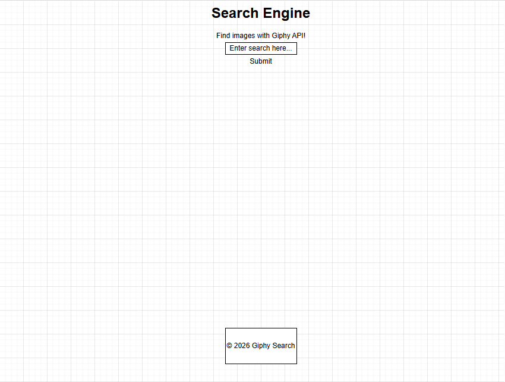
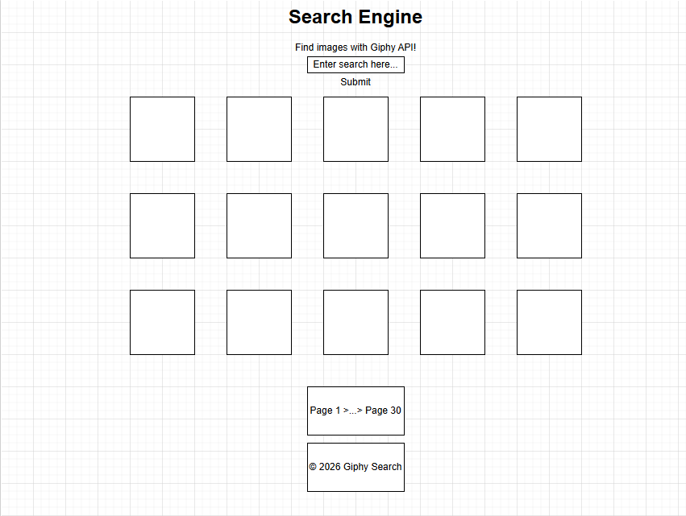
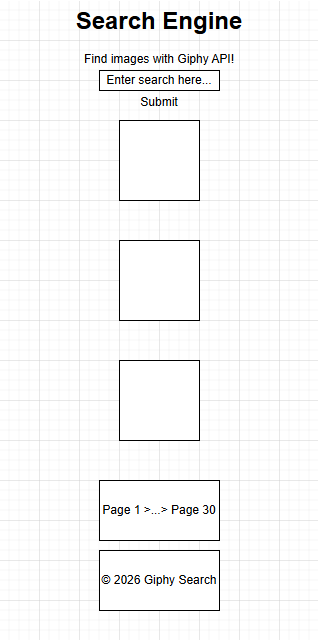

# 🖼️ Giphy Search Engine

## 📌 Description

A website to search for images based on keywords, where results are retrieved by the Giphy API. Works well on both desktop and mobile devices.

---

## 🚀 Features

* Allows users to enter and submit a keyword
* Makes requests to the Giphy API based on that keyword
* Receives and parses the response
* Displays images on the page from that response
* Uses a custom CSS grid to display the images
* Ensures responsiveness so it displays properly on both desktop and mobile

---

## ✍ Wireframes (draw.io)

### First Page


### Results Page (Desktop)


### Results Page (Mobile)


---

## 📸 Screenshots

### First Page


### Results Page (Desktop)


### Results Page (Mobile)

---

## 🧩 User Stories

- As a user, I want to be able to search for images relevant to my input.
- As a user, I want to be able to click submit and have results displayed in a timely manner.
- As a user, I want to be able to view my search results clearly displayed on a page.

---

## 🛠️ Technologies Used

### Frontend

* HTML5
* CSS3
* JavaScript

### Backend

* Giphy API
---

## 📡 API Endpoints

| Method | Endpoint | Description |
|--------|--------|-------------|
|  |  |  |
|  |  |  |
|  |  |  |
|  |  |  |

---

## 📂 Project Structure

Project structure highlighting key application components:

```
MiniProject_NotesApp/
│── assets/
│── css/
│    ├── styles.css
│── js/
│    ├── main.js
│── index.html
│── README.md
```

---

## 🧠 What I Learned

* How to create an API call using JavaScript
* Sharpening CSS and JavaScript expertise
* How to use a public Google Font
* Ensuring Functionality and Robustness of a search engine

---

## 🔮 Future Improvements

* Add Filter Menu
* Give Option to Change Results per page
* Include Static Images in Results

---

## 👤 Author

Amanda McIntire

---

## 📄 License

This project was created as part of a software engineering bootcamp and is intended for educational and portfolio purposes.