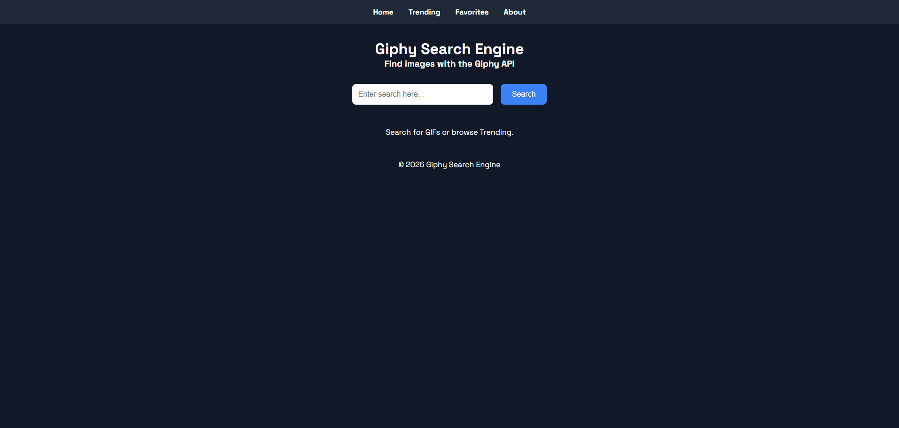
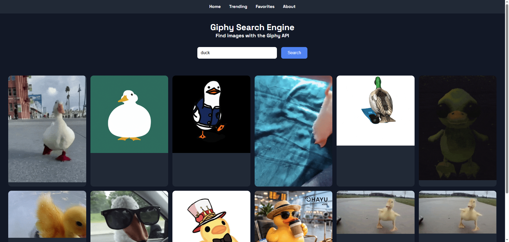
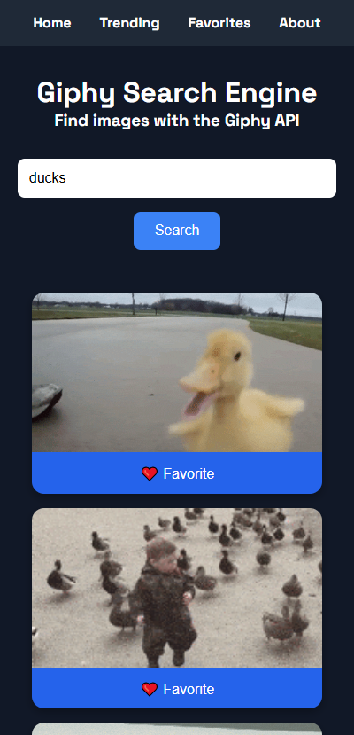

# 🖼️ Giphy Search Engine

## 📌 Description

A website to search for images based on keywords, where results are retrieved by the Giphy API. Works well on both desktop and mobile devices.

---

## 🚀 Features

* Allows users to enter and submit a keyword
* Makes requests to the Giphy API based on that keyword
* Receives and parses the response
* Displays images on the page from that response
* Uses a custom CSS grid to display the images
* Ensures responsiveness so it displays properly on both desktop and mobile

---

## ✍ Wireframes (draw.io)

### First Page


### Results Page (Desktop)


### Results Page (Mobile)


---

## 📸 Screenshots

### First Page


### Results Page (Desktop)


### Results Page (Mobile)


---

## 🧩 User Stories

- As a user, I want to be able to search for images relevant to my input.
- As a user, I want to be able to click submit and have results displayed in a timely manner.
- As a user, I want to be able to view my search results clearly displayed on a page.

---

## 🛠️ Technologies Used

### Frontend

* HTML5
* CSS3
* JavaScript

### APIs & Services

* Giphy API

---

## ⚙️ Installation & Setup

1. Clone the repository:

```bash
git clone https://github.com/your-username/giphy-search-engine.git
```

2. Open the project folder in VSCode.

3. Create a free API key from GIPHY Developers:
   https://developers.giphy.com/

4. Add your API key inside `main.js`:

```javascript
const API_KEY = "YOUR_API_KEY_HERE";
```

5. Run the project using the VSCode Live Server extension.

---

## ▶️ Usage

1. Enter a keyword into the search bar.
2. Click the search button.
3. GIF results will display dynamically in a responsive CSS grid layout.

---

## 📡 API Endpoints

This project uses the GIPHY Search API to retrieve GIFs based on user-entered keywords.

| Method | Endpoint                                 | Description                               |
| ------ | ---------------------------------------- | ----------------------------------------- |
| GET    | `https://api.giphy.com/v1/gifs/search`   | Retrieves GIFs based on a search keyword  |
| GET    | `https://api.giphy.com/v1/gifs/trending` | (Planned Feature) Retrieves trending GIFs |

### Example Request

```javascript
https://api.giphy.com/v1/gifs/search?api_key=YOUR_API_KEY&q=cats&limit=12
```

### Query Parameters

| Parameter | Description                 |
| --------- | --------------------------- |
| `api_key` | Your personal GIPHY API key |
| `q`       | The user's search keyword   |
| `limit`   | Number of GIFs returned     |

For more information, visit the GIPHY Developers Documentation:
https://developers.giphy.com/docs/api/

---

## 📂 Project Structure

Project structure highlighting key application components:

```
PracticeProject_SearchEngine/
│── assets/
│── css/
│    ├── styles.css
│── js/
│    ├── main.js
│── index.html
│── README.md
```

---

## 🧠 What I Learned

* How to fetch and display data from a third-party REST API
* Working with asynchronous JavaScript using `async` and `await`
* Parsing JSON responses from an API
* Dynamically rendering content using DOM manipulation
* Building responsive layouts using CSS Grid and media queries
* Improving mobile responsiveness and cross-device compatibility
* Structuring frontend projects using separate HTML, CSS, and JavaScript files

---

## 🔮 Future Improvements

* Add category and rating filters
* Allow users to select the number of results displayed
* Add loading spinner during API requests
* Display custom error messages for failed searches
* Add fully functional navigation links
* Implement a favorites system using localStorage
* Add infinite scrolling for continuous results
* Add modal popups for enlarged GIF viewing

---

## 🌐 Live Demo

* GitHub Pages

---

## 👤 Author

Amanda McIntire

---

## 📄 License

This project was created as part of a software engineering bootcamp and is intended for educational and portfolio purposes.